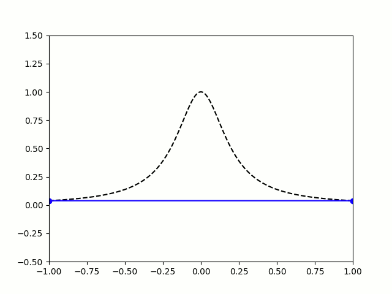

I'm a current first-year at Arizona State University studying math.
My current interests are stochastic processes and diffusion models. 
Hopefully I'll post some blogs soon... 

<u>Formula of the Month:</u>

  The Lagrange basis function 
   
  $$\displaystyle L_{i}(x)=\prod^{N}_{j=1,i\neq j}\frac{x-x_{j}}{x_{i}-x_{j}}$$
  This bad boy follows from the following result:
   
  Suppose we have  $f:[a,b]\rightarrow\mathbb{R}$ and $x_{1} < \dots < x_{N} \in [a,b]$. Then, there exists a unique polynomial, $p(x)$, with degree no greater than $n-1$ that interpolates $f$ at points $x_{1},\dots , x_{N}$. This interpolating polynomial can be expressed as:
   
  $$\displaystyle p(x)=\sum^{N}_{i=1}f(x_{i})L_{i}(x)$$ 
  Expanding this formula, we can see that:
  $$\displaystyle L_{j}(x)=\frac{(x-x_{0})(x-x_{1})\dots (x-x_{N})}{(x_{i}-x_{0})(x_{i}-x_{1})\dots (x_{i}-x_{N})}$$
   
  I am referring to the Weierstrass Approximation Theorem, which (very informally) states that every continuous function on a closed interval is *almost* a polynomial. This seemingly harmless theorem has paved the way for many fields involving computational mathematics. Approximation is king, however not every function is approximated equally. 
     
    Take, for example, the Runge Phenomenon. This is a classic example where vanilla polynomial interpolation *simply fails*. At small degrees, our approximation is going nice, like a drive up Sedona. Unfortunately, as we increase the degree of our polynomials, the error grows without bound (wild oscillations occur near the endpoints). I leave you with the following illustration: 
   
  
  
  
  

